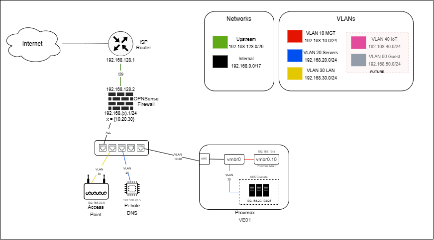

# Homelab Network Topology

This document describes the network topology for the homelab. For the firewall rules that enforce the inter-VLAN policy described here, see [FIREWALL.md](FIREWALL.md).

## Table of Contents

- **[Overview](#overview)**
- **[IP Address Management (IPAM)](#ip-address-management-ipam)**
- **[VLAN Configuration](#vlan-configuration)**
  - [VLAN 10 - Management](#vlan-10---management)
  - [VLAN 20 - Servers](#vlan-20---servers)
  - [VLAN 30 - LAN](#vlan-30---lan)
  - [VLAN 40 - IoT (Future)](#vlan-40---iot-future)
  - [VLAN 50 - Guest (Future)](#vlan-50---guest-future)
- **[Key Network Devices](#key-network-devices)**
  - [ISP Router](#isp-router)
  - [OPNsense Firewall](#opnsense-firewall)
  - [Proxmox Hypervisor](#proxmox-hypervisor)
  - [Pi-hole DNS](#pi-hole-dns)
  - [Access Point](#access-point)
  - [Managed Switch](#managed-switch)

## Overview

The homelab network is designed with multiple VLANs for segmentation and security. The topology includes:

- **Internet Connection**: Via ISP Router
- **Firewall**: OPNsense appliance
- **Core Network Services**: Pi-hole DNS
- **Multiple VLANs**: For management, servers, LAN

## IP Address Management (IPAM)

| VLAN  | Network           | IP Address(es)       | Purpose            |
|-------|-------------------|----------------------|--------------------|
|       | 192.168.128.0/29  |                      | Upstream Network   |
|       |                   | 192.168.128.1        | ISP Router         |
|       |                   | 192.168.128.2        | OPNsense WAN       |
|       | 192.168.0.0/17    |                      | Internal Network   |
| 10    | - 192.168.10.0/24 |                      | VLAN 10            |
|       |                   | 192.168.10.1         | OPNsense MGMT      |
|       |                   | 192.168.10.5-10      | Proxmox MGMT       |
|       |                   | - 192.168.10.5       | PVE01 MGMT         |
|       |                   | 192.168.10.50-55     | DHCP (MGMT Access) |
| 20    | - 192.168.20.0/24 |                      | VLAN 20            |
|       |                   | 192.168.20.1         | OPNsense GW        |
|       |                   | 192.168.20.5-10      | DNS Servers        |
|       |                   | - 192.168.20.5       | pihole-01          |
|       |                   | 192.168.20.16-31     | DHCP (provisioning)|
|       |                   | 192.168.20.192/26    | K8S Clusters       |
|       |                   | - 192.168.20.192/29  | API Server VIPs    |
|       |                   | - 192.168.20.208/28  | Ingress/Egress VIPs|
|       |                   | - 192.168.20.224/27  | Nodes              |
| 30    | - 192.168.30.0/24 |                      | VLAN 30            |
|       |                   | 192.168.30.1         | OPNsense GW        |
|       |                   | 192.168.30.5         | Access Point MGMT  |
|       |                   | 192.168.30.192/26    | DHCP               |
| 40    | - 192.168.40.0/24 |                      | VLAN 40 (FUTURE)   |
|       |                   | 192.168.40.100-254   | DHCP (IoT)         |
| 50    | - 192.168.50.0/24 |                      | VLAN 50 (FUTURE)   |
|       |                   | 192.168.50.100-254   | DHCP (Guest)       |

## VLAN Configuration

### VLAN 10 - Management
- **Purpose**: Management network for infrastructure devices
- **IP Range**: 192.168.10.0/24
- **Gateway**: 192.168.10.1 (OPNsense)
- **Key Devices**:
  - Proxmox management interfaces
  - OPNsense management interface

### VLAN 20 - Servers
- **Purpose**: Server infrastructure
- **IP Range**: 192.168.20.0/24
- **Gateway**: 192.168.20.1 (OPNsense)
- **Key Devices**:
  - Virtual machines on Proxmox
  - Containerized services

### VLAN 30 - LAN
- **Purpose**: Main local area network for trusted devices
- **IP Range**: 192.168.30.0/24
- **Gateway**: 192.168.30.1 (OPNsense)
- **Key Devices**:
  - Smartphones
  - Laptops
  - Other trusted devices

### VLAN 40 - IoT (Future)
- **Purpose**: Isolated network for IoT devices
- **IP Range**: 192.168.40.0/24
- **Gateway**: 192.168.40.1 (OPNsense)
- **Key Devices**:
  - Smart home devices
  - IP cameras
  - Other IoT gadgets

### VLAN 50 - Guest (Future)
- **Purpose**: Guest network with internet access only
- **IP Range**: 192.168.50.0/24
- **Gateway**: 192.168.50.1 (OPNsense)
- **Key Devices**:
  - Guest devices
  - Temporary connections

## Key Network Devices

### ISP Router
- **Upstream Network**: 192.168.128.0/29
- **IP Address**: 192.168.128.1
- **Connection**: Connected to OPNsense WAN interface

### OPNsense Firewall
- **WAN IP**: 192.168.128.2
- **LAN IP**: 192.168.x.1/24 (where x = {10,20,30})
- **Purpose**: Network security, routing, and VLAN management
- **Interfaces**:
  - WAN: Connected to ISP Router
  - LAN: Multiple VLAN interfaces

### Proxmox Hypervisor
- **Management IP**: 192.168.10.5 (VLAN 10)
- **Bridge Interfaces**:
  - vmbr0: Management bridge
  - vmbr0.10: VLAN 10 interface
- **Purpose**: Virtualization platform for homelab services

### Pi-hole DNS
- **IP Address**: 192.168.20.5
- **Purpose**: Network-wide ad blocking and DNS resolution
- **Location**: Connected to VLAN 20

### Access Point
- **IP Address**: 192.168.30.5
- **Purpose**: Wireless connectivity
- **Connection**: Connected to VLAN 30 (LAN)

### Managed Switch
- **IP Address**: TODO
- **Purpose**: VLAN routing and network segmentation
- **Connection**: Trunk ports to OPNsense and Proxmox, access ports to devices
- **VLANs**: Manages VLANs 10, 20, 30